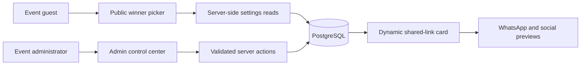
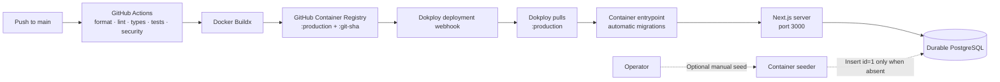

<p align="center">
  
</p>

<h1 align="center">Baithani Winner Picker</h1>

<p align="center">
  A branded, event-ready doorprize picker with controlled draw pools, live administration, audit history, and rich shared-link previews.
</p>

<p align="center">
  <a href="https://github.com/Umah-Creative/baithani-winner-picker/actions/workflows/ci.yml"></a>
  <a href="#license"></a>
  
  
  
  
  
</p>

<p align="center">
  <a href="https://github.com/Umah-Creative/baithani-winner-picker">Repository</a>
  ·
  <a href="#quick-start">Quick start</a>
  ·
  <a href="#production-delivery">Production delivery</a>
  ·
  <a href="docs/ARCHITECTURE.md">Architecture guide</a>
</p>

## Contents

- [What it does](#what-it-does)
- [Architecture](#architecture)
- [Routes](#routes)
- [Quick start](#quick-start)
- [Configuration](#configuration)
- [Admin workflow](#admin-workflow)
- [Sharing and branding](#sharing-and-branding)
- [Database lifecycle](#database-lifecycle)
- [Production delivery](#production-delivery)
- [Commands](#commands)
- [Project structure](#project-structure)
- [Operational notes](#operational-notes)
- [Security](#security)
- [Contributing](#contributing)
- [License](#license)

## What it does

| Capability     | Behavior                                                                                                       |
| -------------- | -------------------------------------------------------------------------------------------------------------- |
| Winner drawing | Draws without repetition from a configurable numeric range and remembers drawn numbers in the current browser. |
| Pool controls  | Supports minimum and maximum values, exclusions, duplicate prevention, undo, and new-session reset.            |
| Event identity | Uses an editable title, description, accent color, uploaded logo, and accessible logo text.                    |
| Shared links   | Generates event-specific Open Graph and Twitter metadata with a dynamic 1200×630 image.                        |
| Administration | Protects settings and audit history behind a signed, password-based admin session.                             |
| Audit history  | Records authentication, settings, and logo events with readable before-and-after details.                      |
| Presentation   | Includes light and dark themes, sound controls, reduced-motion support, and keyboard-driven draws.             |

## Architecture



The application uses the Next.js 16 App Router and feature-first ownership. Route boundaries authenticate, load data, and compose feature entrypoints. Server-only feature queries, commands, and services own persistence; presentational components remain transport-free. See the illustrated [architecture guide](docs/ARCHITECTURE.md) for runtime, transaction, and reverse-proxy trust boundaries.

## Routes

| Route              | Purpose                                                  | Access                   |
| ------------------ | -------------------------------------------------------- | ------------------------ |
| `/`                | Live winner picker or first-run setup state              | Public                   |
| `/admin/login`     | Administrator authentication                             | Public                   |
| `/admin`           | Event identity, appearance, logo, and draw-pool settings | Admin session            |
| `/admin/logs`      | Filterable administrative audit history                  | Admin session            |
| `/api/media/logo`  | Current uploaded event logo                              | Public media endpoint    |
| `/opengraph-image` | Generated event sharing image                            | Public metadata endpoint |

## Quick start

### Requirements

- Node.js `22`
- pnpm `11.21.0`
- PostgreSQL

### Install

```bash
pnpm install
cp .env.example .env.local
```

Configure `.env.local`, then create the database tables:

```bash
pnpm db:migrate
```

The default event seed is optional. Run it when sample starter settings are useful:

```bash
pnpm db:seed
```

Start development:

```bash
pnpm dev
```

Open [http://localhost:3000](http://localhost:3000). Without a settings row, the public page guides the organizer to `/admin`; the first successful settings save creates the active event.

For a stable named URL—especially across worktrees—Portless is highly recommended:

```bash
pnpm dev:portless
```

Portless provides `PORTLESS_URL` to the application. Clear an old local `SITE_URL=http://localhost:3000` override so URL resolution can use the named Portless origin instead of stubbornly pinning itself to localhost like a tiny configuration hostage.

## Configuration

| Variable           | Required   | Description                                                                                                                                                          |
| ------------------ | ---------- | -------------------------------------------------------------------------------------------------------------------------------------------------------------------- |
| `DATABASE_URL`     | Yes        | PostgreSQL connection string used by the application, migrations, and optional seeder.                                                                               |
| `ADMIN_PASSWORD`   | Yes        | Shared password for the protected admin control center.                                                                                                              |
| `ADMIN_SECRET`     | Yes        | Secret of at least 32 bytes used to sign the 24-hour HTTP-only admin session cookie.                                                                                 |
| `SITE_URL`         | Production | Public absolute origin used for canonical URLs and shared-link metadata, for example `https://picker.example.org`.                                                   |
| `TRUST_PROXY_HOPS` | Production | Number of trusted reverse-proxy hops counted from the right side of `X-Forwarded-For`; use `1` only when one direct Dokploy Traefik hop sanitizes forwarded headers. |

Development resolves its origin in this order: valid `SITE_URL`, valid `PORTLESS_URL`, then `http://localhost:3000`. Production uses only a validated `SITE_URL`; request Host headers are never canonical metadata input. When production configuration is missing, sharing URLs are omitted and admin copying stays disabled.

## Admin workflow

1. Sign in at `/admin/login`.
2. Configure the event title and description used by both the picker and shared links.
3. Choose an accent preset or custom color.
4. Upload, replace, remove, or restore the event logo before saving.
5. Set the draw range and add excluded ticket numbers individually or in bulk.
6. Review the picker and shared-link previews, then save.
7. Use `/admin/logs` to review access and settings activity.

The public picker opens from the admin utility area in a separate tab, keeping the editing session intact.

Audit timestamps are stored as absolute PostgreSQL `timestamp with time zone` values and projected as UTC ISO strings. The browser renders them in the operator's current IANA timezone with a visible timezone abbreviation. Date filters submit that timezone so selected calendar days map to correct UTC boundaries, including daylight-saving transitions.

## Sharing and branding

Event title and description are the single content source for the picker and link previews. The uploaded logo and active accent color are composed into a generated Open Graph image without fetching the logo back through HTTP.

Stable Baithani church icons remain the product identity for browser tabs, Apple touch icons, Android installation, and the web manifest. Event-specific information stays in the generated sharing card.

Set `SITE_URL` in production so canonical, Open Graph, and Twitter URLs resolve to the deployed origin when links are shared through WhatsApp or other services.

## Database lifecycle

Migrations and seeds intentionally have different deployment behavior:

- **Migrations run automatically** when the production container starts.
- **Seeds never run automatically** during deployment.
- `pnpm db:seed` remains available for local development.
- The seeder is idempotent: it inserts event settings row `id=1` only when that row is absent.
- The application works without seeded settings and creates the row when an administrator first saves the form.

To seed manually from a Dokploy container terminal:

```bash
cd /app
node src/db/seeders/run.mjs
```

The running container already includes the database scripts and production dependencies. `DATABASE_URL` must be available in the container environment.

## Production delivery

Production uses a prebuilt-image workflow: GitHub Actions verifies the application, publishes the container to GitHub Container Registry, and calls the Dokploy application webhook. Dokploy always follows the moving `production` tag; every release also retains its immutable Git commit SHA tag.



### Deployment contract

| Concern          | Production behavior                                                                                 |
| ---------------- | --------------------------------------------------------------------------------------------------- |
| Artifact         | Prebuilt Docker image published to `ghcr.io/umah-creative/baithani-winner-picker`                   |
| Active tag       | `production`, moved only after verification passes in a workflow running from `main`                |
| Immutable tag    | Full Git commit SHA, retained for traceability and manual rollback                                  |
| Trigger          | Push to `main` or manual workflow dispatch from `main`, followed by the Dokploy application webhook |
| Application port | `3000`                                                                                              |
| Migrations       | Applied automatically by the container entrypoint before the Next.js server starts                  |
| Seeds            | Never automatic; optional and manually invoked from the Dokploy container terminal                  |
| Persistence      | PostgreSQL storage lives outside the disposable application container                               |
| Replica model    | One application replica while migrations remain in the container entrypoint                         |

### Configure Dokploy

1. Add a Docker registry in Dokploy for `ghcr.io`. If the package is private, provide a GitHub personal access token with `read:packages`; a public package needs no registry credentials.
2. Create a Docker-provider application using:

   ```text
   Image: ghcr.io/umah-creative/baithani-winner-picker:production
   Port: 3000
   ```

3. Configure the application environment:

   ```text
   DATABASE_URL=postgresql://...
   ADMIN_PASSWORD=...
   ADMIN_SECRET=...
   SITE_URL=https://your-public-origin.example
   TRUST_PROXY_HOPS=1
   ```

4. Copy the application's [Dokploy deployment webhook](https://docs.dokploy.com/docs/core/auto-deploy) into the GitHub Actions repository secret `DOKPLOY_DEPLOY_WEBHOOK_URL`.
5. Attach the public domain to port `3000`, then push or manually dispatch the workflow from `main`.

In Dokploy's advanced Traefik configuration, apply an application-wide token bucket of 120 requests per minute with burst 60 and IPv6 source grouping at `/64`. This is an operator-owned deployment prerequisite, not something the repository can enable or verify. Once configured, Traefik throttles before traffic reaches Next.js; the application still performs credential-specific lockout and authorization.

On every normal release, checks must pass before either image tag moves. GitHub Actions pushes both tags, calls the webhook, and Dokploy pulls the refreshed `production` image. The container applies pending migrations and starts the standalone Next.js server.

### Roll back

Each published commit remains available by its full SHA tag. To restore one, change the Dokploy application image from `:production` to `:<git-sha>` and deploy it. Restore the configured tag to `:production` before the next normal release so future webhooks pull the moving production image again.

Build and run the same image locally:

```bash
docker build -t baithani-winner-picker .
docker run --env-file .env.local -p 3000:3000 baithani-winner-picker
```

To exercise the generated standalone output without Docker, build first and then use the local launcher. It loads local environment configuration, copies `public` and `.next/static`, links the installed project dependencies into the standalone directory, and starts Next's generated server:

```bash
pnpm build
pnpm start
```

> [!IMPORTANT]
> Automatic migrations assume one application replica starts at a time. Before scaling to multiple replicas, move migrations into a one-shot deployment job.

## Commands

| Command                                | Purpose                                                             |
| -------------------------------------- | ------------------------------------------------------------------- |
| `pnpm dev`                             | Start the Next.js development server.                               |
| `pnpm dev:portless`                    | Start development through Portless `0.7.0` with a stable named URL. |
| `pnpm build`                           | Create the production build.                                        |
| `pnpm start`                           | Prepare assets and run the generated standalone server locally.     |
| `pnpm test`                            | Run the Vitest suite.                                               |
| `pnpm lint`                            | Run ESLint.                                                         |
| `pnpm check-type`                      | Generate route types and run TypeScript without emitting files.     |
| `pnpm prettier`                        | Check formatting.                                                   |
| `pnpm audit --prod --audit-level high` | Reject high-severity production dependency advisories.              |
| `pnpm db:generate`                     | Generate Drizzle migrations after schema changes.                   |
| `pnpm db:migrate`                      | Apply pending database migrations.                                  |
| `pnpm db:seed`                         | Optionally insert the default event settings row when absent.       |

## Project structure

```text
.
├── public/                 Static Baithani identity assets and manifest
├── scripts/                Container startup utilities
├── docs/                   Architecture and engineering rulebook
├── src/
│   ├── app/                Thin App Router, metadata, and HTTP boundaries
│   ├── components/         Shared layout, theme, and generated UI primitives
│   ├── db/                 Drizzle schema, migrations, and optional seeders
│   ├── features/           Auth, admin shell, audit, settings, sharing, and picker ownership
│   ├── shared/             Proven cross-feature brand, URL, request, security, and draw-pool policy
│   └── lib/utils.ts        shadcn `cn` boundary only
├── Dockerfile              Multi-stage production image
└── package.json            Runtime pins and project commands
```

## Operational notes

- Admin authentication uses one deployment password, constant-time comparison, and a signed HTTP-only `SameSite=Strict` cookie; it is not a multi-user identity system.
- Five credential failures in 15 minutes lock the client-IP bucket. The sixth and later attempts remain blocked even with the correct password. Limits reset when the process restarts and are not shared across replicas.
- `proxy.ts` overwrites internal attribution headers, generates every request ID, returns `X-Request-ID`, and applies nonce CSP plus browser hardening headers. Dokploy Traefik remains the TLS/HSTS boundary; its global rate limit exists only after the documented operator configuration is applied.
- Draw history is browser-local. Starting a new browser session or clearing storage does not change persisted event settings.
- Uploaded logos support PNG, JPEG, WebP, and GIF up to 5 MB.
- Uploaded logo MIME claims are verified against file signatures before persistence.
- Audit metadata is sanitized before display, but operators should still avoid placing secrets in editable event content.

## Security

| Layer                | Repository behavior                                                                                                                             |
| -------------------- | ----------------------------------------------------------------------------------------------------------------------------------------------- |
| Admin authentication | Constant-time password comparison and a signed, 24-hour HTTP-only `SameSite=Strict` session cookie.                                             |
| Login abuse          | Five failures in 15 minutes lock the client-IP bucket; a separate Traefik token bucket is operator-configured defense in depth.                 |
| Request trust        | `proxy.ts` replaces internal attribution headers and issues request IDs; trusted-hop parsing assumes the documented direct-proxy configuration. |
| Uploaded media       | Logo size, claimed MIME, and PNG/JPEG/WebP/GIF file signatures are validated before persistence.                                                |
| Audit integrity      | Settings and their audit events commit atomically; authentication audit failures remain best-effort and privacy-safe.                           |
| Supply chain         | Frozen pnpm installs, pinned CI/container actions, Dependabot, tests, builds, and production dependency auditing guard delivery.                |

Read the [security policy](SECURITY.md) before reporting a vulnerability. Use GitHub private vulnerability reporting, never a public issue, for security-sensitive details.

## Contributing

Focused contributions are welcome. Read [CONTRIBUTING.md](CONTRIBUTING.md), [CODE_OF_CONDUCT.md](CODE_OF_CONDUCT.md), the [architecture guide](docs/ARCHITECTURE.md), and [support guide](SUPPORT.md) before opening substantial work.

## License

Application source code and documentation are available under the [MIT License](LICENSE), copyright &copy; 2026 Umah Creative.

Baithani names, logos, event marks, and derived application icons are not included in the MIT grant. See [Baithani brand assets](BRAND_ASSETS.md) for the applicable restrictions.

---

<p align="center">
  Built for Multimedia Baithani events · <a href="https://github.com/Umah-Creative/baithani-winner-picker">View source on GitHub</a>
</p>
