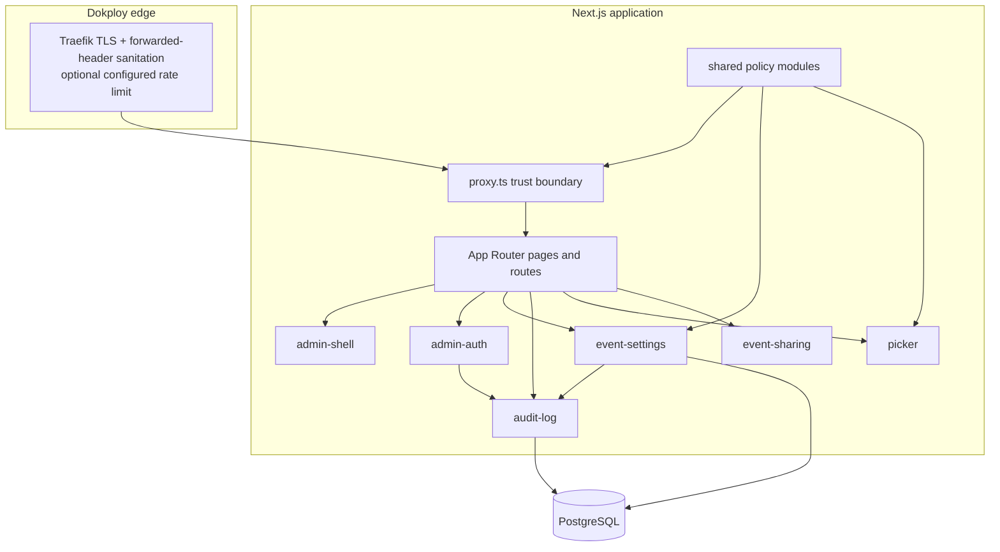
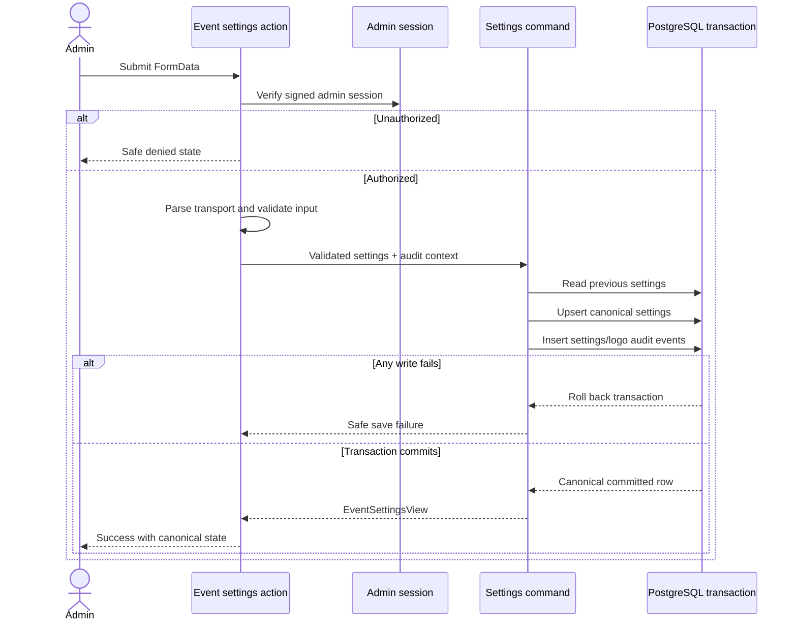

# Architecture

Baithani Winner Picker is a Next.js App Router application organized by feature ownership. Routes authenticate, load data, and compose feature entrypoints; server-only feature modules own persistence and request adaptation.

## Runtime and feature boundaries



- `src/app` contains thin framework boundaries.
- `src/features` owns domain UI, hooks, client-safe contracts, server queries, commands, and services.
- `src/shared` contains only proven cross-feature policy: brand, draw-pool limits, request context, security, and site URL resolution.
- `src/components` contains shared layout, theme, and generated UI primitives.
- `src/lib/utils.ts` remains the generated shadcn `cn` boundary.

## Authenticated settings transaction



## Reverse-proxy trust boundary

```mermaid
sequenceDiagram
  participant Client
  participant Traefik
  participant Proxy as Next.js proxy.ts
  participant App as Server component/action
  participant Audit as Audit persistence

  Client->>Traefik: HTTPS request + untrusted headers
  Traefik->>Traefik: Sanitize forwarded headers; apply configured rate limit
  Traefik->>Proxy: Trusted X-Forwarded-For chain
  Proxy->>Proxy: Select configured right-side hop
  Proxy->>Proxy: Generate request ID and CSP nonce
  Proxy->>App: Overwritten internal attribution headers
  App->>Audit: Bounded client IP, request ID, agent, language
  Proxy-->>Client: Security headers + X-Request-ID
```

Production assumes one direct Dokploy Traefik hop (`TRUST_PROXY_HOPS=1`) that sanitizes forwarded headers, plus one application replica. Traefik owns TLS/HSTS. It owns the recommended global token bucket only after the operator applies the documented Dokploy configuration; the repository cannot enable or verify that edge control. The application owns request attribution, CSP, sessions, authorization, validation, transactions, and privacy-safe audit projection.
